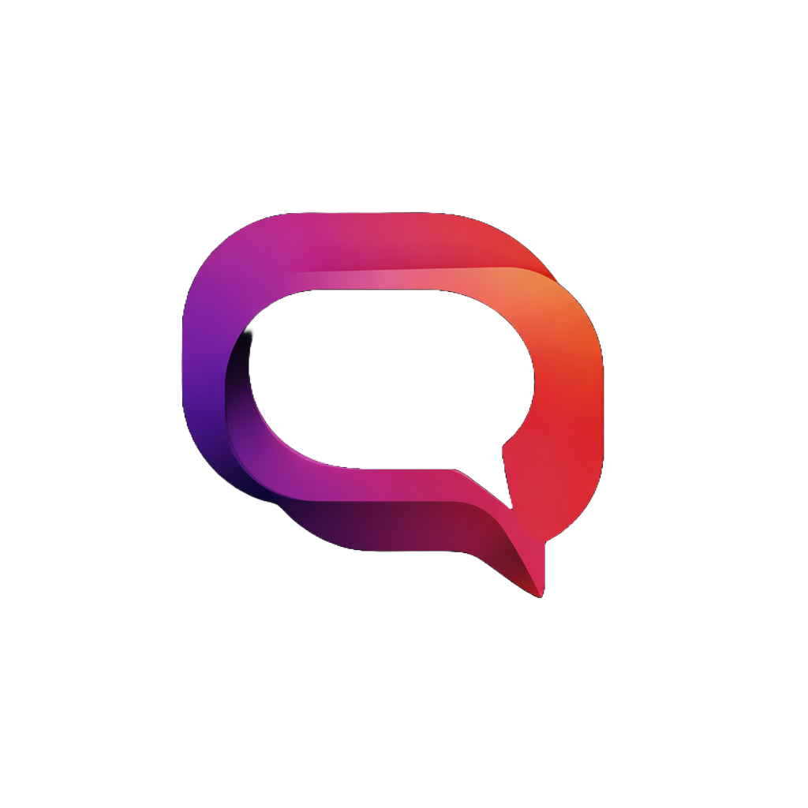

  
  
  # Goorac Quantum
  **Next-Generation Quantum Computing Infrastructure**

---

## 🌐 Overview

**Goorac Quantum** is an advanced, proprietary quantum computing platform developed by Goorac Corporation. Designed for enterprise-scale computational problem solving, it integrates cutting-edge quantum algorithms with highly secure infrastructure. 

## 🏢 Corporate Leadership

**Goorac Corporation** is driven by a mission to revolutionize computing through quantum mechanics and advanced engineering. 

* **Chief Executive Officer (CEO):** [Insert CEO Name]
* **Headquarters:** [Insert Location/City]
* **Mission:** To provide unparalleled quantum computational power while maintaining the highest standards of corporate security and data integrity.

Under the leadership of our CEO and executive board, Goorac Corporation remains at the forefront of the quantum technology sector, partnering with elite enterprise clients globally.

---

## ⚠️ Legal, Copyright & Licensing

**STRICTLY CONFIDENTIAL AND PROPRIETARY**

This repository, including all source code, documentation, algorithms, and related assets, is the sole and exclusive property of **Goorac Corporation**. 

* **NOT OPEN SOURCE:** This is **closed-source**, private software. 
* **COPYRIGHT:** © [Current Year] Goorac Corporation. All Rights Reserved.
* **NO DISTRIBUTION:** You may not copy, reproduce, distribute, publish, display, perform, modify, create derivative works, transmit, or in any way exploit any part of this code or documentation without the express, prior written consent of Goorac Corporation.
* **UNAUTHORIZED ACCESS:** Any unauthorized access, use, or distribution of this material is strictly prohibited and will be prosecuted to the maximum extent of the law. 

If you have received access to this repository in error, you must immediately delete all local copies and notify Goorac Corporation's legal department at [Insert Legal Email].

---

## 🛠️ Usage & Documentation

*Note: Access to Goorac Quantum environments requires valid enterprise authentication and an active licensing agreement.*

For authorized personnel, full technical documentation, API endpoints, and deployment guides can be found on our secure internal portal:
**[Link to Internal Secure Docs]**

## 📞 Support & Contact

For technical assistance, authorized users may contact the Goorac Quantum Enterprise Support team:

* **Support Portal:** [Insert Support Link]
* **Enterprise Contact:** [Insert Contact Email]
